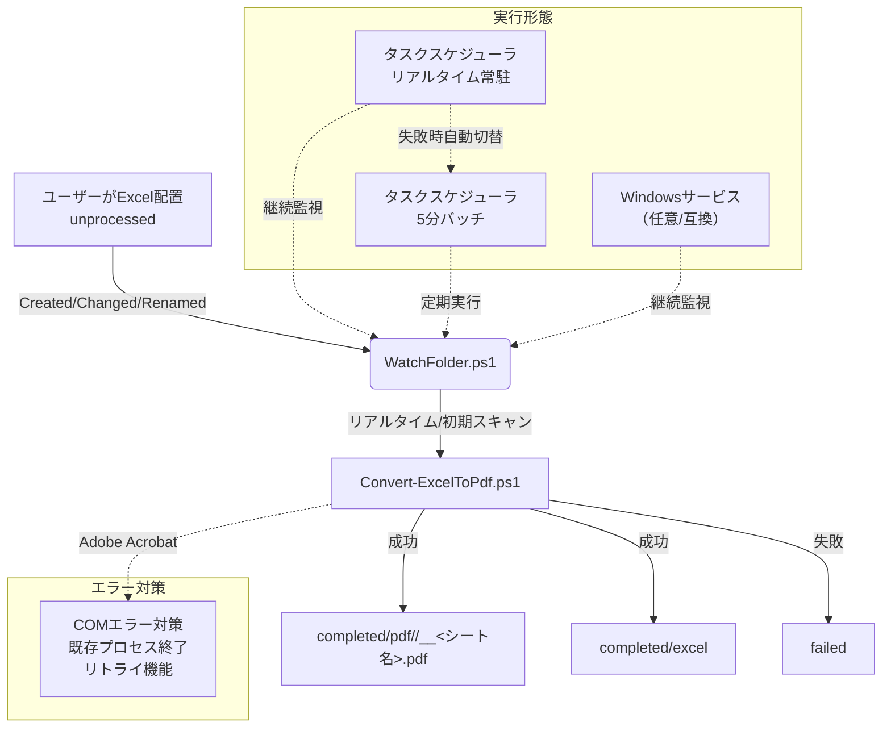

# Excel to PDF Converter (PowerShell Script)

## 概要 (Overview)

このプロジェクトは、Adobe Acrobat Proを利用して、指定されたフォルダ内にあるExcelファイルを自動でPDFに変換するPowerShellスクリプト群です。

最新の実行形態は「タスクスケジューラ（リアルタイム常駐/ログオン時）」を優先し、利用できない環境では「タスクスケジューラ（5分ごとバッチ）」へフォールバックします。従来の「Windowsサービス」は任意（レガシー互換）としてサポートされます。堅牢なファイル管理と詳細なログ出力機能により、安定した運用が可能です。

## 主な機能 (Features)

  * **リアルタイム自動変換**: `unprocessed` フォルダに配置されたExcelファイル（`.xlsx`, `.xls`）を即座に検知し、自動でPDFに変換します。
  * **フォルダ監視による自動実行**: タスクスケジューラのリアルタイム常駐（ログオン時起動）を基本とし、ファイル追加を即座に検知して変換処理を実行します。
  * **フォールバック機能**: リアルタイム常駐が使えない環境では、タスクスケジューラの5分ごとのチェック実行に自動切替します（インストーラが自動設定）。
  * **堅牢なフォルダ管理**: 処理状況に応じてファイルが自動でフォルダ分け（作業中、完了、失敗）されるため、進捗管理が容易です。
  * **詳細なログ出力**: スクリプトの実行開始から終了、各ファイルの処理成否まで、すべてが日付ごとのログファイルに記録されます。
  * **エラーハンドリング**: 変換に失敗したファイルは `failed` フォルダに隔離され、エラー内容がログに出力されるため、問題の追跡が簡単です。
  * **リソース管理**: 処理完了後にAcrobatのプロセスを確実に終了させ、不要なリソースの残存を防ぎます。
  * **COMエラー対策**: Adobe AcrobatのCOMエラーを回避するため、既存プロセスの確認・終了とリトライ機能を実装しています。
  * **初期スキャン**: 監視開始時に `unprocessed` の既存ファイルも自動で取りこぼしなく処理します。
  * **書き込み完了待ち**: 追加直後のファイルは最大30秒の書き込み完了待機で安定処理します。
  * **ディレクトリ説明ファイル**: 各フォルダに説明用の空ファイルを自動生成し、用途を明示します。
  * **全シート個別PDF出力（新機能）**: 各Excelブック内の全ワークシートを個別のPDFに出力し、ファイル名にシート名を含めます。出力はブック単位の専用ディレクトリに格納されます。

## 動作環境 (Prerequisites)

  * **OS**: Windows 10 / Windows 11 / Windows Server
  * **PowerShell**: 5.1以上 (Windows 10/11に標準搭載)
  * **必須ソフトウェア**:
      * **Adobe Acrobat Pro DC** （または同等のCOMコンポーネントを持つバージョン）— ライセンス認証済みであること（必須）。
      * **Microsoft Excel**（2016以降推奨）— 各シートのPDF化にExcelのExportAsFixedFormatを使用します（必須）。
      * *無料のAcrobat Readerでは動作しません。*

### Acrobatの要件（重要）

- **有償版が必須**: Adobe AcrobatのCOM自動化（`AcroExch` など）は、Acrobat Pro/Standardなどの有償版にのみ含まれます。無料のAdobe Acrobat Readerは非対応です。
- **COMコンポーネント単体の提供なし**: COMコンポーネントのみを個別にインストールすることはできません。必ずライセンス認証済みのAcrobat本体をインストールしてください。
- **対象バージョンの例**: Acrobat Pro DC、Acrobat Standard DC、Acrobat（サブスクリプション版）など。いずれもライセンス認証が必要です。
- **公式情報**: 詳細はAdobe公式ヘルプをご参照ください（`https://helpx.adobe.com/jp/acrobat/kb/cq04060649.html`）。
- **動作の前提**: 本スクリプトはExcelで一時PDFを作成後、AcrobatのCOM経由で開いて最終保存します。そのため、Acrobatが正常に起動・ライセンス認証済みであること、およびCOM登録が正しく行われていることが前提です。

## セットアップ (Setup)

1.  **スクリプトの配置**
    `Convert-ExcelToPdf.ps1` ファイルを、管理しやすい任意の場所に保存します。

2.  **PowerShell実行ポリシーの設定**
    セキュリティのため、PowerShellはデフォルトでスクリプトの実行を制限している場合があります。PowerShellを **管理者として開き**、以下のコマンドを実行してスクリプトの実行を許可してください。

    ```powershell
    Set-ExecutionPolicy RemoteSigned -Scope Process -Force
    ```

    *このコマンドは、現在開いているPowerShellウィンドウでのみ、ローカルに保存されたスクリプトの実行を許可するものです。ポリシーを恒久的に変更したい場合は `-Scope Process` を削除してください。*

## 使用方法 (Usage)

1.  **作業ディレクトリの準備**
    変換処理の拠点となるディレクトリを決定します（例: `C:\ExcelConversion`）。このディレクトリは、スクリプト初回実行時に自動で作成されるため、手動で作成する必要はありません。

    **注意**: `-BasePath` パラメータを指定しない場合、スクリプト実行時のカレントディレクトリが作業ディレクトリとして使用されます。

2.  **変換したいExcelファイルの配置**
    PDFに変換したいExcelファイルを、作業ディレクトリ内の `unprocessed` フォルダに配置します。
    （初回は `unprocessed` フォルダも自動生成されます）

3.  **スクリプトの実行**
    PowerShellを開き、以下のコマンドを実行します。`-BasePath` パラメータはオプショナルです。

    **BasePathを指定する場合:**
    ```powershell
    # Convert-ExcelToPdf.ps1 を保存したディレクトリに移動
    cd C:\Path\To\Your\Scripts

    # スクリプトを実行（BasePathを指定）
    .\Convert-ExcelToPdf.ps1 -BasePath "C:\ExcelConversion"
    ```

    **BasePathを指定しない場合（カレントディレクトリを使用）:**
    ```powershell
    # 作業ディレクトリに移動
    cd C:\ExcelConversion

    # スクリプトを実行（BasePathを指定しない）
    .\Convert-ExcelToPdf.ps1
    ```

    実行後、`unprocessed` フォルダ内のExcelファイルが処理され、結果に応じて各フォルダに振り分けられます。

## フォルダ構造と処理フロー (Directory Structure & Workflow)

スクリプトは `-BasePath` で指定されたディレクトリ（指定されない場合はカレントディレクトリ）内に、以下のフォルダ構造を自動で生成・利用します。

```
C:\ExcelConversion
├── 📂 unprocessed     <-- ① 変換したいExcelファイルをここに入れる
├── 📂 processing      <-- ② 処理中のファイルが一時的にここに移動
├── 📂 completed       <-- ③ 変換成功後、ファイルがここに格納される
│   ├── 📂 excel       <--    元のExcelファイルがここに移動
│   └── 📂 pdf         <--    変換されたPDFファイルがここに保存
│       └── 📂 <Excelファイル名>   <-- 各ブック専用ディレクトリ（新仕様）
├── 📂 failed          <-- ④ 変換に失敗したExcelファイルがここに移動
└── 📂 logs            <-- ⑤ 実行ログが日付ごとのファイルで保存される
```

### 新しいPDF出力仕様（全シート個別）

- **出力単位**: ブック内の各ワークシートを個別のPDFとして出力
- **出力先**: `completed/pdf/<Excelファイル名>/`
- **ファイル名**: `<Excelファイル名>__<シート名>.pdf`
- **ファイル名サニタイズ**: Windowsで使用できない文字は自動で`_`に置換。長すぎる名前は適宜カット。重複するシート名には`_2`, `_3`…を付与。

### 処理フロー

1.  ユーザーが変換したいExcelファイルを `unprocessed` フォルダに配置します。
2.  スクリプトが実行されると、`unprocessed` フォルダ内のファイルを検知します。
3.  ファイルは `processing` フォルダに移動され、PDFへの変換処理が開始されます。
4.  **成功した場合**:
      * 各シートごとのPDFが `completed/pdf/<Excelファイル名>/` に保存されます（新仕様）。
      * 元のExcelファイルが `completed/excel` に移動します。
5.  **失敗した場合**:
      * 処理中だったExcelファイルが `failed` フォルダに移動します。
      * エラー内容が `logs` フォルダ内のログファイルに記録されます。

## Adobe使用要件と内部処理

- 本スクリプトは、各シートを一時PDFとして出力（ExcelのExportAsFixedFormatを使用）した後、**Adobe Acrobat COM（AcroExch）で開いて最終保存**します。
- これにより、Adobe Acrobatを必ず経由してPDFが生成されるため、要件「Adobeを使うのは必須」を満たします。
- 既存のAcrobatプロセス終了やCOMリトライ、オブジェクト解放など、安定動作のための対策も実装されています。

## 自動監視機能 (Auto Monitoring Feature)

### 概要

`unprocessed`フォルダにファイルが追加されたことを自動検知し、`Convert-ExcelToPdf.ps1`を自動実行する常駐機能（タスク常駐/バッチ、任意でサービス）を提供します。

### ファイル構成

```
excel-to-pdf-by-acrobat/
├── Convert-ExcelToPdf.ps1      # 既存の変換スクリプト
├── WatchFolder.ps1             # ファイル監視サービス
├── Install-Watcher.ps1         # インストールスクリプト
├── Uninstall-Watcher.ps1       # アンインストールスクリプト
├── Run-Watcher.ps1             # 監視タスクの再起動ヘルパー
├── config.json                 # 設定ファイル
└── README.md                   # このファイル
```

### インストール手順（リアルタイム常駐タスク優先 → 5分バッチにフォールバック）

1. **管理者権限でPowerShellを開く**
   ```powershell
   # 管理者としてPowerShellを起動
   ```

2. **設定ファイルの編集**
   `config.json`は相対パスで設定されており、スクリプトのディレクトリ基準で解決されます。必要に応じて絶対パスも指定可能です：
   ```json
   {
     "ServiceName": "ExcelToPdfWatcher",
     "WatchPath": "unprocessed",
     "ScriptPath": "Convert-ExcelToPdf.ps1",
     "LogPath": "logs",
     "FileFilters": ["*.xlsx", "*.xls"],
     "Description": "Excel to PDF変換のファイル監視サービス設定",
     "Version": "1.0.0",
     "LastUpdated": "2025-01-22"
   }
   ```

   - `WatchPath`/`ScriptPath`/`LogPath` は相対・絶対どちらでも指定できます（内部で解決）。
   - `FileFilters` はワイルドカードで複数指定可能です（例: `*.xlsx`, `*.xls`）。
   - `ServiceName` はタスク/サービス名としても用いられます（リアルタイムは `-RealTime` が付与）。

   **注意**: パスはスクリプトと同じディレクトリを基準とした相対パスで指定されています。別の場所に配置したい場合は、絶対パスで指定することも可能です。

3. **インストール（リアルタイム常駐タスク優先 → 失敗時は5分バッチにフォールバック）**
   ```powershell
   .\Install-Watcher.ps1
   ```

   **動作の優先順位**:
   - **タスクスケジューラ（リアルタイム常駐）**（推奨）: ログオン時に起動し、継続的にフォルダ監視
   - **タスクスケジューラ（5分バッチ）**（フォールバック）: 5分ごとのチェック実行
   - **Windowsサービス**（任意/互換）: 環境に応じて利用可能

### 使用方法（自動監視）

- **基本操作**: `unprocessed`フォルダにExcelファイルを配置するだけ（リアルタイム自動変換）
- **リアルタイム常駐タスクの管理（推奨）**:
  ```powershell
  # 状態確認/開始/停止（タスク名: ExcelToPdfWatcher-RealTime）
  Get-ScheduledTask -TaskName "ExcelToPdfWatcher-RealTime"
  Start-ScheduledTask -TaskName "ExcelToPdfWatcher-RealTime"
  Stop-ScheduledTask -TaskName "ExcelToPdfWatcher-RealTime"

  # 再起動ヘルパー
  .\Run-Watcher.ps1  # 既定のタスク名を再起動
  .\Run-Watcher.ps1 -TaskName "CustomTaskName"  # 任意指定
  ```

- **5分バッチ監視タスクの管理（フォールバック時）**:
  ```powershell
  # タスクの状態確認
  Get-ScheduledTask -TaskName "ExcelToPdfWatcher"
  # 実行履歴/詳細はタスクスケジューラGUIかイベントログを参照
  ```

- **ログ確認**:
  ```powershell
  # 監視ログ
  Get-Content .\logs\watcher-$(Get-Date -Format 'yyyy-MM-dd').log -Tail 100

  # 変換処理ログ
  Get-Content .\logs\$(Get-Date -Format 'yyyy-MM-dd').log -Tail 100

  # インストール/アンインストールログ
  Get-Content .\logs\install-$(Get-Date -Format 'yyyy-MM-dd').log -Tail 100
  Get-Content .\logs\uninstall-$(Get-Date -Format 'yyyy-MM-dd').log -Tail 100
  ```

## アーキテクチャ（監視・変換フロー）



## 補足（シート名とファイル名の扱い）

- Windowsで使用できない文字（`<>:"/\\|?*` など）は自動的に`_`へ置換します。
- 空名・空白のみの名前は `Sheet` に置換します。
- 同名シートがある場合は `_2`, `_3` ... といった連番を付与します。
- 非ASCIIや非常に長いシート名は適宜トリミングされます（約120文字を上限）。

## トラブルシューティング (Troubleshooting)

  * **エラー: `New-Object : COM コンポーネントのクラス ファクトリを取得中に、次のエラーが発生しました:...`**

      * **原因**: Adobe Acrobat Proが正しくインストールされていないか、ライセンス認証に問題がある可能性があります。
      * **対策**: Acrobat Proが正常に起動・動作することを確認してください。再インストールが必要な場合もあります。

  * **ファイルが変換されず、`failed` フォルダに移動する**

      * **原因**: Excelファイルが破損している、パスワードで保護されている、またはAcrobatが対応していない形式である可能性があります。
      * **対策**: `logs` フォルダ内のログファイルを確認し、詳細なエラーメッセージを確認してください。対象のExcelファイルを手動で開き、PDFとして保存できるか試すことも有効な切り分けです。

  * **スクリプトを実行すると赤いエラーメッセージが表示される**

      * **原因**: PowerShellの実行ポリシーが `Restricted` になっている可能性があります。
      * **対策**: [セットアップ](https://www.google.com/search?q=%23%E3%82%BB%E3%83%83%E3%83%88%E3%82%A2%E3%83%83%E3%83%97) の手順に従い、実行ポリシーを変更してください。

  * **自動監視（サービス/タスク）が動作しない**

      * **原因**: 管理者権限でインストールされていない、または設定ファイルのパスが正しくない可能性があります。
      * **対策**:
        1. 管理者権限でPowerShellを開き直す
        2. `config.json`のパス設定を確認する
        3. ` .\Uninstall-Watcher.ps1`でアンインストール後、` .\Install-Watcher.ps1`で再インストールする
        4. `logs`フォルダ内の`watcher-*.log`ファイルでエラー詳細を確認する
        5. リアルタイムタスクが停止でも、5分バッチが稼働していれば監視は継続します（`Get-ScheduledTask -TaskName "ExcelToPdfWatcher"`）。

  * **サービスが起動しない（Adobe Acrobat COM エラー）**

      * **原因**: Adobe AcrobatのCOMオブジェクトがSYSTEMアカウントで実行できない場合があります。
      * **対策**: 本プロジェクトは自動でタスクスケジューラ（リアルタイム→5分バッチ）にフォールバックします。サービス運用時はアカウントを現在のユーザーに設定すると回避できる場合があります。

  * **ファイルが追加された直後に変換されない/失敗する**

      * **原因**: ネットワーク経由や大容量で書き込みが長引く場合、ロック解除前に処理すると失敗します。
      * **対策**: 自動で最大30秒待機します。頻発する場合は書き込み完了後に配置する運用に見直してください。

  * **ファイルを追加しても自動変換されない**

      * **原因**: フォルダ監視サービスが停止している、またはタスクスケジューラが正しく設定されていない可能性があります。
      * **対策**:
        1. サービス状態を確認: `Get-Service -Name "ExcelToPdfWatcher"`
        2. タスクスケジューラ状態を確認: `schtasks /Query /TN "ExcelToPdfWatcher"`
        3. ログファイルでエラー詳細を確認: `Get-Content .\logs\watcher-$(Get-Date -Format 'yyyy-MM-dd').log -Tail 50`
