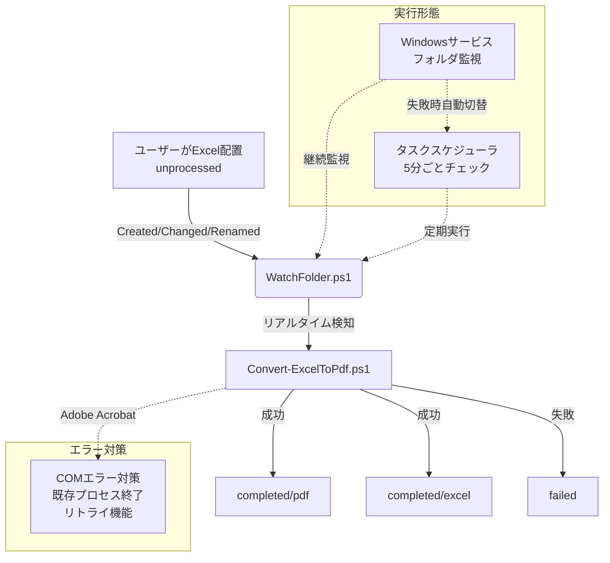

# Excel to PDF Converter (PowerShell Script)

## 概要 (Overview)

このプロジェクトは、Adobe Acrobat Proを利用して、指定されたフォルダ内にあるExcelファイルを自動でPDFに変換するPowerShellスクリプト群です。

リアルタイム監視は原則として「Windowsサービス」によるフォルダ監視を基本とし、サービス起動できない環境では「タスクスケジューラ（5分ごと）」へフォールバックして確実に稼働します。堅牢なファイル管理と詳細なログ出力機能により、安定した運用が可能です。

## 主な機能 (Features)

  * **リアルタイム自動変換**: `unprocessed` フォルダに配置されたExcelファイル（`.xlsx`, `.xls`）を即座に検知し、自動でPDFに変換します。
  * **フォルダ監視による自動実行**: Windowsサービスによる継続的なフォルダ監視を基本とし、ファイル追加を即座に検知して変換処理を実行します。
  * **フォールバック機能**: サービス起動できない環境では、タスクスケジューラによる5分ごとのチェック実行に自動切替します。
  * **堅牢なフォルダ管理**: 処理状況に応じてファイルが自動でフォルダ分け（作業中、完了、失敗）されるため、進捗管理が容易です。
  * **詳細なログ出力**: スクリプトの実行開始から終了、各ファイルの処理成否まで、すべてが日付ごとのログファイルに記録されます。
  * **エラーハンドリング**: 変換に失敗したファイルは `failed` フォルダに隔離され、エラー内容がログに出力されるため、問題の追跡が簡単です。
  * **リソース管理**: 処理完了後にAcrobatのプロセスを確実に終了させ、不要なリソースの残存を防ぎます。
  * **COMエラー対策**: Adobe AcrobatのCOMエラーを回避するため、既存プロセスの確認・終了とリトライ機能を実装しています。

## 動作環境 (Prerequisites)

  * **OS**: Windows 10 / Windows 11 / Windows Server
  * **PowerShell**: 5.1以上 (Windows 10/11に標準搭載)
  * **必須ソフトウェア**: **Adobe Acrobat Pro DC** （または同等のCOMコンポーネントを持つバージョン）がインストールされ、ライセンス認証済みであること。
      * *無料のAcrobat Readerでは動作しません。*

## セットアップ (Setup)

1.  **スクリプトの配置**
    `Convert-ExcelToPdf.ps1` ファイルを、管理しやすい任意の場所に保存します。

2.  **PowerShell実行ポリシーの設定**
    セキュリティのため、PowerShellはデフォルトでスクリプトの実行を制限している場合があります。PowerShellを **管理者として開き**、以下のコマンドを実行してスクリプトの実行を許可してください。

    ```powershell
    Set-ExecutionPolicy RemoteSigned -Scope Process -Force
    ```

    *このコマンドは、現在開いているPowerShellウィンドウでのみ、ローカルに保存されたスクリプトの実行を許可するものです。ポリシーを恒久的に変更したい場合は `-Scope Process` を削除してください。*

## 使用方法 (Usage)

1.  **作業ディレクトリの準備**
    変換処理の拠点となるディレクトリを決定します（例: `C:\ExcelConversion`）。このディレクトリは、スクリプト初回実行時に自動で作成されるため、手動で作成する必要はありません。

    **注意**: `-BasePath` パラメータを指定しない場合、スクリプト実行時のカレントディレクトリが作業ディレクトリとして使用されます。

2.  **変換したいExcelファイルの配置**
    PDFに変換したいExcelファイルを、作業ディレクトリ内の `unprocessed` フォルダに配置します。
    （初回は `unprocessed` フォルダも自動生成されます）

3.  **スクリプトの実行**
    PowerShellを開き、以下のコマンドを実行します。`-BasePath` パラメータはオプショナルです。

    **BasePathを指定する場合:**
    ```powershell
    # Convert-ExcelToPdf.ps1 を保存したディレクトリに移動
    cd C:\Path\To\Your\Scripts

    # スクリプトを実行（BasePathを指定）
    .\Convert-ExcelToPdf.ps1 -BasePath "C:\ExcelConversion"
    ```

    **BasePathを指定しない場合（カレントディレクトリを使用）:**
    ```powershell
    # 作業ディレクトリに移動
    cd C:\ExcelConversion

    # スクリプトを実行（BasePathを指定しない）
    .\Convert-ExcelToPdf.ps1
    ```

    実行後、`unprocessed` フォルダ内のExcelファイルが処理され、結果に応じて各フォルダに振り分けられます。

## フォルダ構造と処理フロー (Directory Structure & Workflow)

スクリプトは `-BasePath` で指定されたディレクトリ（指定されない場合はカレントディレクトリ）内に、以下のフォルダ構造を自動で生成・利用します。

```
C:\ExcelConversion
├── 📂 unprocessed     <-- ① 変換したいExcelファイルをここに入れる
├── 📂 processing      <-- ② 処理中のファイルが一時的にここに移動
├── 📂 completed       <-- ③ 変換成功後、ファイルがここに格納される
│   ├── 📂 excel       <--    元のExcelファイルがここに移動
│   └── 📂 pdf         <--    変換されたPDFファイルがここに保存
├── 📂 failed          <-- ④ 変換に失敗したExcelファイルがここに移動
└── 📂 logs            <-- ⑤ 実行ログが日付ごとのファイルで保存される
```

### 処理フロー

1.  ユーザーが変換したいExcelファイルを `unprocessed` フォルダに配置します。
2.  スクリプトが実行されると、`unprocessed` フォルダ内のファイルを検知します。
3.  ファイルは `processing` フォルダに移動され、PDFへの変換処理が開始されます。
4.  **成功した場合**:
      * 生成されたPDFファイルが `completed/pdf` に保存されます。
      * 元のExcelファイルが `completed/excel` に移動します。
5.  **失敗した場合**:
      * 処理中だったExcelファイルが `failed` フォルダに移動します。
      * エラー内容が `logs` フォルダ内のログファイルに記録されます。

## 自動監視機能 (Auto Monitoring Feature)

### 概要

`unprocessed`フォルダにファイルが追加されたことを自動検知し、`Convert-ExcelToPdf.ps1`を自動実行する常駐機能（サービス or タスク）を提供します。

### ファイル構成

```
excel-to-pdf-by-acrobat/
├── Convert-ExcelToPdf.ps1      # 既存の変換スクリプト
├── WatchFolder.ps1             # ファイル監視サービス
├── Install-Watcher.ps1         # インストールスクリプト
├── Uninstall-Watcher.ps1       # アンインストールスクリプト
├── config.json                 # 設定ファイル
└── README.md                   # このファイル
```

### インストール手順（Windowsサービス優先 → タスクスケジューラフォールバック）

1. **管理者権限でPowerShellを開く**
   ```powershell
   # 管理者としてPowerShellを起動
   ```

2. **設定ファイルの編集**
   `config.json`は相対パスで設定されているため、そのまま使用できます：
   ```json
   {
     "ServiceName": "ExcelToPdfWatcher",
     "WatchPath": "unprocessed",
     "ScriptPath": "Convert-ExcelToPdf.ps1",
     "LogPath": "logs",
     "FileFilters": ["*.xlsx", "*.xls"]
   }
   ```

   **注意**: パスはスクリプトと同じディレクトリを基準とした相対パスで指定されています。別の場所に配置したい場合は、絶対パスで指定することも可能です。

3. **インストール（Windowsサービス優先 → 失敗時はタスクスケジューラにフォールバック）**
   ```powershell
   .\Install-Watcher.ps1
   ```

   **動作の優先順位**:
   - **Windowsサービス**（推奨）: フォルダ監視によるリアルタイム自動実行
   - **タスクスケジューラ**（フォールバック）: 5分ごとのチェック実行

### 使用方法（自動監視）

- **基本操作**: `unprocessed`フォルダにExcelファイルを配置するだけ（リアルタイム自動変換）
- **Windowsサービス管理**（推奨）:
  ```powershell
  # サービスの状態確認/開始/停止
  Get-Service -Name "ExcelToPdfWatcher"
  Start-Service -Name "ExcelToPdfWatcher"
  Stop-Service -Name "ExcelToPdfWatcher"
  ```

- **タスクスケジューラ管理**（フォールバック時）:
  ```powershell
  # タスクの状態確認（5分ごとの実行）
  schtasks /Query /TN "ExcelToPdfWatcher" /V /FO LIST | Out-String
  ```

- **ログ確認**:
  ```powershell
  # 監視ログの確認
  Get-Content .\logs\watcher-$(Get-Date -Format 'yyyy-MM-dd').log -Tail 100
  
  # 変換処理ログの確認
  Get-Content .\logs\$(Get-Date -Format 'yyyy-MM-dd').log -Tail 100
  ```

### アンインストール（サービスとタスクの両方をクリーンに削除）

```powershell
# サービスを停止・削除
.\Uninstall-Watcher.ps1

# ログファイルも保持したい場合
.\Uninstall-Watcher.ps1 -KeepLogs
```

### 特徴

- ✅ **リアルタイム監視**: ファイル追加を即座に検知（Windowsサービス）
- ✅ **自動実行**: 手動でのスクリプト実行が不要
- ✅ **フォルダ監視優先**: Windowsサービスによる継続的なフォルダ監視を基本とする
- ✅ **フォールバック機能**: サービス起動不可時はタスクスケジューラ（5分ごと）に自動切替
- ✅ **簡単管理**: ワンコマンドでインストール・アンインストール
- ✅ **詳細ログ**: 監視・実行状況を詳細に記録
- ✅ **エラーハンドリング**: 既存サービスの自動停止・再登録
- ✅ **初期スキャン**: ウォッチャー起動時に既存ファイルも取りこぼしなく処理
- ✅ **COMエラー対策**: Adobe AcrobatのCOMエラーを回避するリトライ機能

## トラブルシューティング (Troubleshooting)

  * **エラー: `New-Object : COM コンポーネントのクラス ファクトリを取得中に、次のエラーが発生しました:...`**

      * **原因**: Adobe Acrobat Proが正しくインストールされていないか、ライセンス認証に問題がある可能性があります。
      * **対策**: Acrobat Proが正常に起動・動作することを確認してください。再インストールが必要な場合もあります。

  * **ファイルが変換されず、`failed` フォルダに移動する**

      * **原因**: Excelファイルが破損している、パスワードで保護されている、またはAcrobatが対応していない形式である可能性があります。
      * **対策**: `logs` フォルダ内のログファイルを確認し、詳細なエラーメッセージを確認してください。対象のExcelファイルを手動で開き、PDFとして保存できるか試すことも有効な切り分けです。

  * **スクリプトを実行すると赤いエラーメッセージが表示される**

      * **原因**: PowerShellの実行ポリシーが `Restricted` になっている可能性があります。
      * **対策**: [セットアップ](https://www.google.com/search?q=%23%E3%82%BB%E3%83%83%E3%83%88%E3%82%A2%E3%83%83%E3%83%97) の手順に従い、実行ポリシーを変更してください。

  * **自動監視（サービス/タスク）が動作しない**

      * **原因**: 管理者権限でインストールされていない、または設定ファイルのパスが正しくない可能性があります。
      * **対策**:
        1. 管理者権限でPowerShellを開き直す
        2. `config.json`のパス設定を確認する
        3. `.\Uninstall-Watcher.ps1`でアンインストール後、`.\Install-Watcher.ps1`で再インストールする
        4. `logs`フォルダ内の`watcher-*.log`ファイルでエラー詳細を確認する
        5. サービスが停止でも、タスクスケジューラ（5分ごと）が稼働していれば監視は有効です（`schtasks /Query /TN "ExcelToPdfWatcher"`）。

  * **サービスが起動しない（Adobe Acrobat COM エラー）**

      * **原因**: Adobe AcrobatのCOMオブジェクトがSYSTEMアカウントで実行できない場合があります。
      * **対策**: 本プロジェクトは自動でタスクスケジューラ（5分ごと）にフォールバックします。サービスアカウントを現在のユーザーに設定することで、COMエラーを回避できます。

  * **ファイルを追加しても自動変換されない**

      * **原因**: フォルダ監視サービスが停止している、またはタスクスケジューラが正しく設定されていない可能性があります。
      * **対策**:
        1. サービス状態を確認: `Get-Service -Name "ExcelToPdfWatcher"`
        2. タスクスケジューラ状態を確認: `schtasks /Query /TN "ExcelToPdfWatcher"`
        3. ログファイルでエラー詳細を確認: `Get-Content .\logs\watcher-$(Get-Date -Format 'yyyy-MM-dd').log -Tail 50`

## アーキテクチャ（監視・変換フロー）



### 動作の優先順位

1. **Windowsサービス**（推奨）
   - フォルダ監視によるリアルタイム自動実行
   - ファイル追加を即座に検知して変換処理を実行
   - 継続的に動作

2. **タスクスケジューラ**（フォールバック）
   - 5分ごとのチェック実行
   - サービス起動できない環境での保険
   - バッチモードで一度だけ実行して終了
